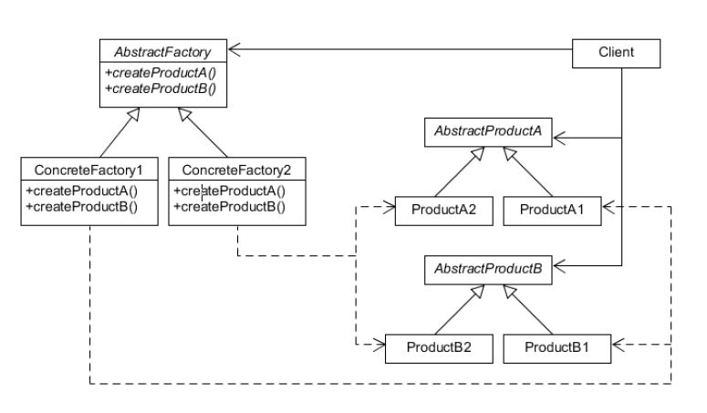

### Abstract Factory Pattern (추상 팩토리 패턴)

- 많은 수의 연관된 서브 클래스를 특정 그룹으로 묶어 한번에 교체할 수 있도록 만든 디자인 패턴
- 상세화된 서브클래스를 정의하지 않고도 서로 관련성이 있거나 독립적인 여러 객체의 군을 생성하기 위한 인터페이스를 제공
- 예를 들어 특정 라이브러리를 배포하는데 OS별로 지원하는 기능이 상이하다면 추상 팩토리 패턴을 사용해 OS별 기능 변경을 통합적으로 변경 할 수 있다.

 

[Abstract Factory]

 
