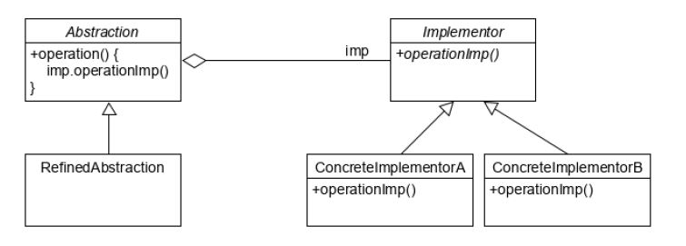

### Bridge Pattern (컴포지트 패턴)

- 구현(implementation)으로부터 추상(abstraction) 레이어를 분리하여 이 둘이 서로 독립적으로 변화할 수 있도록 한다.
- 구현부에서 추상층을 분리하여 각자 독립적으로 변형할 수 있게 하는 패턴이다.
- 추상화(abstraction)와 구현(implement)이 독립적으로 다른 계층 구조를 가질 수 있고, 클라이언트 어플리케이션으로부터 구현을 숨기고 싶을 때 사용될 수 있다.

 

[Shape - Draw]

 

[Bridge]

 
