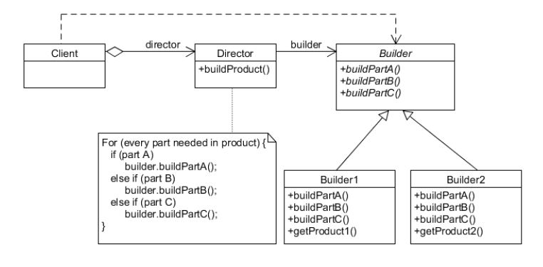

### Builder Pattern (빌더 패턴)

- 복잡한 객체를 생성하는 방법을 정의하는 클래스와 표현하는 방법을 정의하는 클래스를 별도로 분리하여, 서로 다른 표현이라도 이를 생성할 수 있는 동일한 절차를 제공하는 패턴
- 생성 인자가 많을 시, 빌더 객체를 통해 구체적인 객체를 생성한다.
- 생성해야 되는 객체가 Optional한 속성을 많이 가질 때 빛을 발휘한다.

 

[Builder]

 
