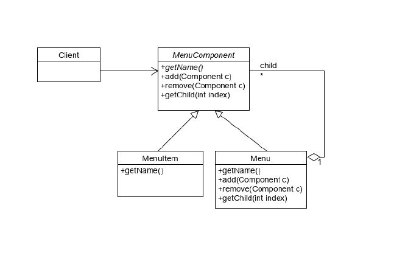
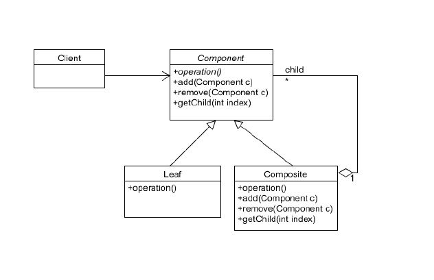

### Composite Pattern (컴포지트 패턴)

- 단일 객체와 그 객체들을 가지는 집합 객체를 같은 타입으로 취급하며, 트리 구조로 객체들을 엮는 패턴이다.
- 여러 개의 객체들로 구성된 복합 객체와 단일 객체를 클라이언트에서 구별 없이 다루게 해주는 패턴이다.
- 클라이언트가 복합 객체(group of object) 나 단일 객체를 동일하게 취급하는 것을 목적으로 한다.

 

[Menu]

 

[Composite]

 
