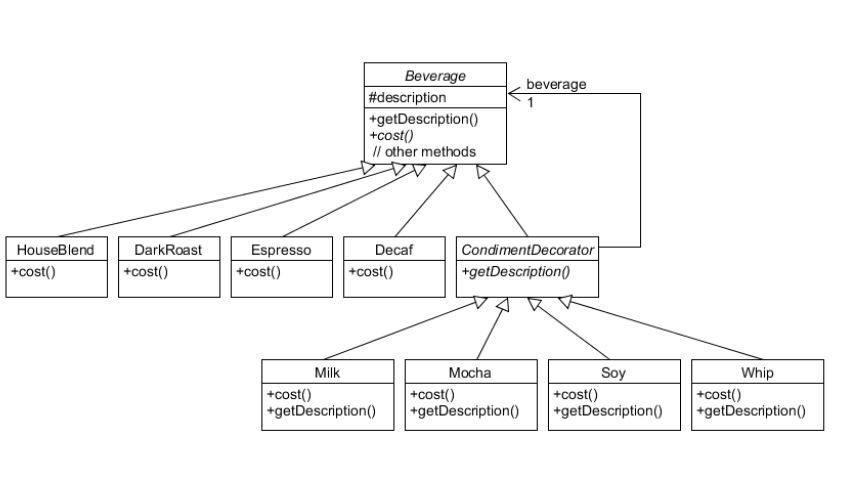
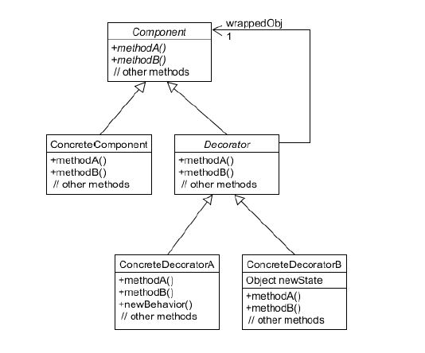

### Decorator Pattern (데코레이터 패턴)

- 객체를 동적(dynamic)으로 서브 클래스를 이용해 확장할 수 있는 패턴
- 객체에 추가적인 요건을 동적으로 첨가한다.
- 데코레이터는 서브클래스를 만드는 것을 통해서 기능을 유연하게 확장할 수 있는 방법을 제공한다.

 

[Beverage]

 

[Decorator Patterns]

