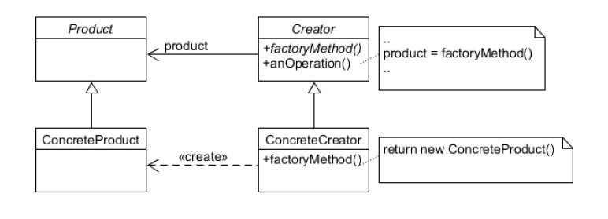

### Factory Method Pattern (팩토리 메소드 패턴)

- 객체를 만들어내는 부분을 서브 클래스(Sub-Class)에 위임하는 패턴.
- 객체를 생성하기 위해 인터페이스를 정의하지만, 어떤 클래스의 인스턴스를 생성할지에 대한 결정은 서브클래스가 내리도록 한다.

 

[Pizza Store]

 

[Factory Method]

 
