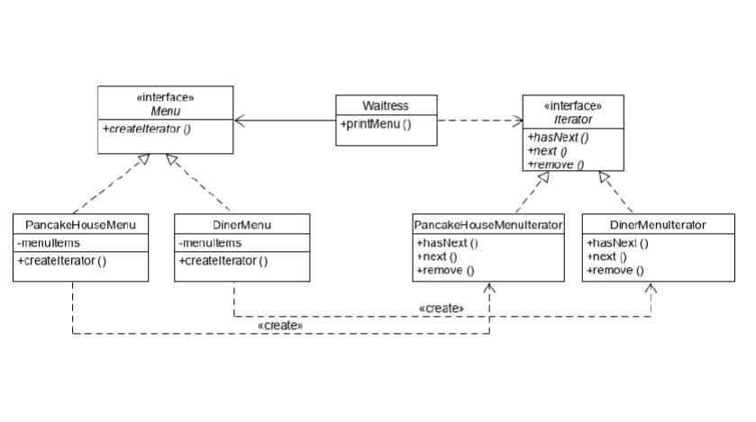

### Iterator Pattern (반복자 패턴)

- 컬렉션 구현 방법을 노출시키지 않으면서도 그 집합체안에 들어있는 모든 항목에 접근할 수 있게 해 주는 방법을 제공해 주는 패턴.
- 객체안의 항목 또는 컬렉션 객체 안에 들어있는 모든 항목에 접근하는 방식을 통일할 수 있다. 이렇게 접근 방식을 통일하게 되면 어떤 종류의 객체에 대해서도 사용할 수 있는 다형적인 코드를 만들 수 있다.
  
 

[Waitress]

 
