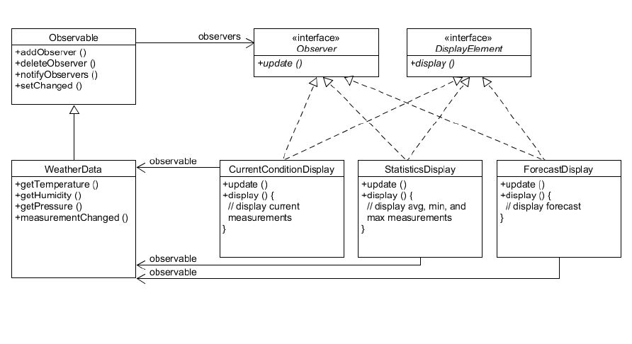

### Observer Pattern (관찰자 패턴)

- 객체 사이에 일 대 다의 의존 관계를 정의해 두어, 어떤 객체의 상태가 변할 때 그 객체에 의존성을 가진 다른 객체들이 그 변화를 통지받고 자동으로 갱신될 수 있게 만든다.
- 객체의 상태 변화를 관찰하는 관찰자들, 즉 옵저버들의 목록을 객체에 등록하여 상태 변화가 있을 때마다 메서드 등을 통해 객체가 직접 목록의 각 옵저버에게 통지하도록 하는 설계 방법
  
 

[Weather]

 
