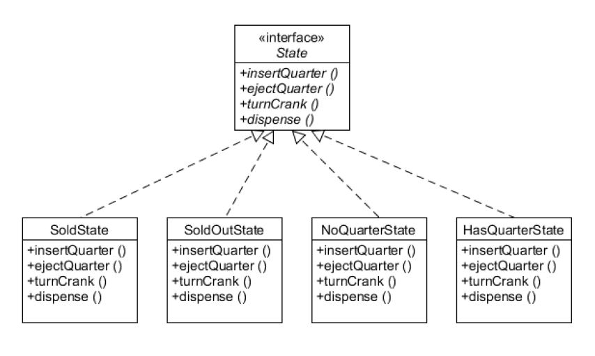

### State Pattern (상태 패턴)

- 객체가 특정 상태에 따라 행위를 달리하는 상황에서, 자신이 직접 상태를 체크하여 상태에 따라 행위를 호출하지 않고, 상태를 객체화 하여 상태가 행동을 할 수 있도록 위임하는 패턴
- 객체의 상태에 따라 각각의 행위를 변경할 수 있게 캡슐화하며, 동적으로 행동을 교체할 수 있다
- Strategy Pattern (전략 패턴) 과 구조는 거의 동일하나 쓰임의 용도가 다르다

 

[GumballMachine]

 
