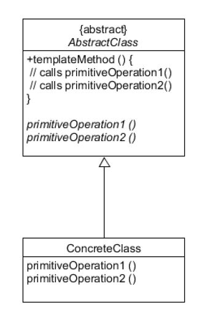

### TemplateMethod Pattern (템플릿 메소드 패턴)

- 객체의 연산에는 알고리즘의 뼈대만을 정의하고 각 단계에서 수행할 구체적 처리는 서브클래스 쪽으로 미룬다. 
- 알고리즘의 구조 자체는 그대로 놔둔 채 알고리즘 각 단계 처리를 서브클래스에서 재정의할 수 있게 한다.
- 여러 클래스에 공통되는 사항은 상위 추상 클래스에서 구현하고, 각각의 상세부분은 하위 클래스에서 구현한다.
  
 

[TemplateMethod]

 
